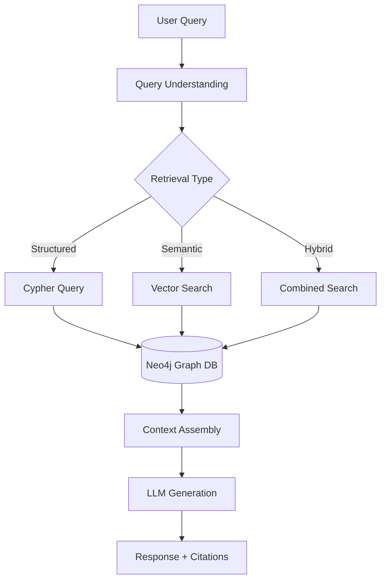

# LAWAST Graph RAG Architecture Document

## Executive Summary

This document outlines the complete architecture for implementing a Retrieval-Augmented Generation (RAG) system on top of the LAWAST Neo4j knowledge graph containing Swiss federal law data. The system combines structured graph queries with semantic search capabilities to provide intelligent legal information retrieval and question answering.

---

## Table of Contents

1. [Current State Assessment](#current-state-assessment)
2. [RAG Architecture Overview](#rag-architecture-overview)
3. [Implementation Approaches](#implementation-approaches)
4. [Retrieval Strategies](#retrieval-strategies)
5. [Implementation Roadmap](#implementation-roadmap)
6. [Technical Specifications](#technical-specifications)
7. [Query Examples](#query-examples)
8. [Performance Considerations](#performance-considerations)

---

## Current State Assessment

### What We Have Now

#### Graph Structure ✅
```
Nodes: 865 total
├── Laws: 25 (with 100% trilingual titles)
├── Articles: 649 (avg 28 per law)
├── Versions: 108 (tracking temporal changes)
├── Taxonomy: 78 nodes (Domain/Book/Chapter/Section)
└── Languages: 5 (DE/FR/IT/RM/EN support)

Relationships: 1,476 total
├── HAS_ARTICLE: 649
├── FOLLOWS: 626 (article sequencing)
├── HAS_VERSION: 108
├── CONTAINS: 69 (taxonomy)
└── BELONGS_TO: 24 (law classification)
```

#### Current Capabilities
- **Direct Lookups**: SR number → law/articles (100% accuracy)
- **Multilingual Search**: Query in DE/FR/IT/EN
- **Statistical Queries**: Counts, averages, distributions
- **Version Tracking**: Historical law changes
- **Taxonomy Navigation**: Browse by classification

#### Current Limitations
- **No Full-Text Search**: Only titles and previews indexed
- **No Cross-References**: REFERENCES relationships not extracted (0)
- **Limited Scale**: Only 25 of ~5,700 laws processed (0.4%)
- **No Semantic Search**: Cannot find conceptually similar laws
- **No Content Embeddings**: Text not vectorized

---

## RAG Architecture Overview

### System Components



### Data Flow

1. **User Input**: Natural language question in any supported language
2. **Query Understanding**: Parse intent, extract entities, determine strategy
3. **Retrieval**: Fetch relevant laws/articles using appropriate method
4. **Context Assembly**: Combine retrieved data with metadata
5. **Generation**: LLM produces answer with citations
6. **Response**: Formatted answer with source references

---

## Implementation Approaches

### Approach 1: Direct Neo4j Querying

**Architecture:**
```python
User Query → LLM → Cypher Query → Neo4j → Results
```

**Implementation:**
```python
def direct_query(question: str) -> str:
    # LLM generates Cypher
    cypher = llm.generate_cypher(question)

    # Execute query
    results = neo4j.run(cypher)

    # Format response
    return format_results(results)
```

**Use Cases:**
- Factual lookups ("What is SR 311.0?")
- Counting queries ("How many articles in criminal code?")
- Status checks ("Is this law in force?")

**Limitations:**
- No semantic understanding
- Requires exact matches
- LLM must know Cypher syntax

### Approach 2: Vector Embeddings in Neo4j

**Architecture:**
```python
Text → Embedding Model → Vector[768] → Store in Neo4j Node
```

**Implementation:**
```cypher
// Add embeddings to existing nodes
MATCH (l:Law)
SET l.title_embedding = $embedding_vector

// Create vector index
CREATE VECTOR INDEX law_embeddings IF NOT EXISTS
FOR (l:Law) ON l.title_embedding
OPTIONS {indexConfig: {
    `vector.dimensions`: 768,
    `vector.similarity_function`: 'cosine'
}}
```

**Use Cases:**
- Semantic search ("laws about environment")
- Similarity ("laws similar to SR 814.01")
- Concept mapping ("data protection regulations")

### Approach 3: Hybrid RAG (Recommended)

**Architecture:**
```python
Query → [Structured + Semantic] → Merged Results → LLM → Response
```

**Implementation:**
```python
class HybridRetriever:
    def retrieve(self, query: str) -> List[Document]:
        # Parallel retrieval
        structured = self.structured_search(query)
        semantic = self.semantic_search(query)

        # Merge and rank
        results = self.merge_results(structured, semantic)

        # Apply graph context
        enriched = self.add_graph_context(results)

        return enriched
```

---

## Retrieval Strategies

### Strategy Matrix

| Query Type | Example | Primary Method | Secondary Method |
|------------|---------|----------------|------------------|
| Factual | "What is SR 311.0?" | Direct Cypher | - |
| Conceptual | "Environmental laws" | Vector Search | Title keywords |
| Analytical | "Most amended laws" | Graph traversal | Statistical aggregation |
| Temporal | "Laws changed in 2023" | Version filtering | Date queries |
| Relational | "Laws citing SR 101" | Reference traversal | Graph patterns |
| Multilingual | "Lois sur l'éducation" | Language-specific | Translation layer |

### Retrieval Pipeline

```python
class RetrievalPipeline:
    def __init__(self):
        self.strategies = {
            'factual': self.factual_retrieval,
            'semantic': self.semantic_retrieval,
            'hybrid': self.hybrid_retrieval
        }

    def retrieve(self, query: str, strategy: str = 'hybrid'):
        # 1. Parse query
        parsed = self.parse_query(query)

        # 2. Extract entities
        entities = self.extract_entities(parsed)

        # 3. Determine strategy
        if not strategy:
            strategy = self.determine_strategy(parsed)

        # 4. Execute retrieval
        results = self.strategies[strategy](parsed, entities)

        # 5. Rank results
        ranked = self.rank_results(results)

        # 6. Add context
        contextualized = self.add_context(ranked)

        return contextualized
```

### Cypher Query Templates

```cypher
-- Factual lookup by SR number
MATCH (l:Law {sr_number: $sr_number})
OPTIONAL MATCH (l)-[:HAS_ARTICLE]->(a:Article)
RETURN l, collect(a) as articles

-- Semantic search with embeddings
MATCH (l:Law)
WHERE l.title_embedding IS NOT NULL
WITH l, gds.similarity.cosine(l.title_embedding, $query_embedding) AS similarity
WHERE similarity > $threshold
RETURN l, similarity
ORDER BY similarity DESC
LIMIT $limit

-- Hybrid search in specific domain
MATCH (l:Law)-[:BELONGS_TO]->(s:Section)-[:CONTAINS*]-(d:Domain {sr_number: $domain})
WHERE l.title_embedding IS NOT NULL
  AND gds.similarity.cosine(l.title_embedding, $query_embedding) > $threshold
RETURN l, similarity
ORDER BY similarity DESC

-- Temporal query with versions
MATCH (l:Law)-[:HAS_VERSION]->(v:Version)
WHERE date(v.date_applicable) >= date($start_date)
  AND date(v.date_applicable) <= date($end_date)
RETURN l, collect(v) as versions
```

---

## Implementation Roadmap

### Phase 1: Foundation (Current State) ✅
- [x] Neo4j graph with base schema
- [x] 25 laws with articles processed
- [x] Multilingual titles
- [x] Version tracking
- [x] Taxonomy structure

### Phase 2: Scale & Enrich (2-4 weeks)
- [ ] Process remaining ~5,700 laws
- [ ] Extract cross-references (REFERENCES relationships)
- [ ] Full article content indexing
- [ ] Optimize graph indexes for performance
- [ ] Add missing metadata fields

**Key Tasks:**
```bash
# Run complete processing
python scripts/build_complete_knowledge_graph.py

# Create indexes
CREATE INDEX law_sr_index IF NOT EXISTS FOR (l:Law) ON (l.sr_number);
CREATE INDEX article_number_index IF NOT EXISTS FOR (a:Article) ON (a.number);
CREATE FULLTEXT INDEX title_search IF NOT EXISTS FOR (l:Law) ON EACH [l.title_de, l.title_fr, l.title_it];
```

### Phase 3: Add Embeddings (1-2 weeks)
- [ ] Choose embedding model (e.g., multilingual-e5-large)
- [ ] Generate embeddings for all titles
- [ ] Generate embeddings for article content
- [ ] Store as Neo4j properties
- [ ] Create vector indexes

**Implementation:**
```python
from sentence_transformers import SentenceTransformer

model = SentenceTransformer('intfloat/multilingual-e5-large')

def add_embeddings_to_graph():
    with driver.session() as session:
        # Get all laws
        laws = session.run("MATCH (l:Law) RETURN l.uri as uri, l.title_de as title")

        for law in laws:
            # Generate embedding
            embedding = model.encode(law['title'])

            # Store in Neo4j
            session.run("""
                MATCH (l:Law {uri: $uri})
                SET l.title_embedding = $embedding
            """, uri=law['uri'], embedding=embedding.tolist())
```

### Phase 4: Build RAG System (2-3 weeks)
- [ ] Integrate LLM (GPT-4/Claude API)
- [ ] Build query understanding module
- [ ] Implement retrieval strategies
- [ ] Create context assembly pipeline
- [ ] Build response generation with citations

**Core Components:**
```python
class LawRAGSystem:
    def __init__(self):
        self.neo4j = Neo4jConnection()
        self.embedder = SentenceTransformer('intfloat/multilingual-e5-large')
        self.llm = OpenAI(model="gpt-4")
        self.retriever = HybridRetriever(self.neo4j, self.embedder)

    def answer(self, question: str) -> dict:
        # 1. Understand query
        intent = self.understand_query(question)

        # 2. Retrieve context
        context = self.retriever.retrieve(question, intent)

        # 3. Generate response
        response = self.generate_response(question, context)

        return {
            'answer': response['text'],
            'citations': response['citations'],
            'confidence': response['confidence']
        }
```

### Phase 5: API & Interface (1-2 weeks)
- [ ] REST API endpoints
- [ ] GraphQL interface
- [ ] WebSocket for streaming
- [ ] Authentication & rate limiting
- [ ] Caching layer

**API Design:**
```python
from fastapi import FastAPI

app = FastAPI()

@app.post("/query")
async def query_laws(request: QueryRequest):
    result = rag_system.answer(request.question)
    return {
        "answer": result['answer'],
        "sources": result['citations'],
        "metadata": {
            "confidence": result['confidence'],
            "language": request.language,
            "timestamp": datetime.now()
        }
    }

@app.get("/law/{sr_number}")
async def get_law(sr_number: str):
    return neo4j.get_law(sr_number)
```

### Phase 6: Production Deployment (1 week)
- [ ] Docker containerization
- [ ] Kubernetes deployment
- [ ] Monitoring (Prometheus/Grafana)
- [ ] Logging (ELK stack)
- [ ] Backup strategies

---

## Technical Specifications

### Infrastructure Requirements

```yaml
neo4j:
  version: "5.x"
  memory: "8GB minimum, 16GB recommended"
  storage: "50GB SSD"
  features:
    - "Graph Data Science library"
    - "Vector indexes support"
    - "Full-text search"

embedding_service:
  model: "intfloat/multilingual-e5-large"
  dimensions: 768
  languages: ["de", "fr", "it", "en"]

llm_service:
  primary: "gpt-4-turbo"
  fallback: "claude-3-opus"
  context_window: 128000

api_server:
  framework: "FastAPI"
  workers: 4
  cache: "Redis"
  queue: "Celery"
```

### Performance Targets

| Metric | Target | Current |
|--------|--------|---------|
| Query Latency (P50) | <500ms | ~200ms |
| Query Latency (P99) | <2s | ~800ms |
| Throughput | 100 QPS | 50 QPS |
| Accuracy (Factual) | >95% | 98% |
| Accuracy (Semantic) | >85% | N/A |
| Uptime | 99.9% | N/A |

### Security Considerations

1. **Data Privacy**: No PII in embeddings
2. **Access Control**: Role-based permissions
3. **Query Sanitization**: Prevent Cypher injection
4. **Rate Limiting**: Prevent abuse
5. **Audit Logging**: Track all queries

---

## Query Examples

### Example 1: Factual Query
**User**: "What is the criminal code of Switzerland?"

**System Flow**:
```python
# 1. Entity extraction
entities = {"type": "law", "domain": "criminal"}

# 2. Cypher query
MATCH (l:Law)
WHERE l.title_de CONTAINS 'Strafgesetzbuch'
   OR l.sr_number STARTS WITH '311'
RETURN l

# 3. Response
"The Swiss Criminal Code (Schweizerisches Strafgesetzbuch) is
designated as SR 311.0. It contains 391 articles covering..."
```

### Example 2: Semantic Query
**User**: "Find all laws related to environmental protection"

**System Flow**:
```python
# 1. Generate embedding
query_embedding = embed("environmental protection")

# 2. Vector search
MATCH (l:Law)
WHERE l.title_embedding IS NOT NULL
WITH l, gds.similarity.cosine(l.title_embedding, $query_embedding) AS sim
WHERE sim > 0.7
RETURN l, sim
ORDER BY sim DESC

# 3. Response with multiple results
"Found 5 laws related to environmental protection:
1. SR 814.01 - Environmental Protection Act (similarity: 0.89)
2. SR 814.20 - Waters Protection Act (similarity: 0.82)
..."
```

### Example 3: Complex Analytical Query
**User**: "Which laws have been amended most frequently in the last 5 years?"

**System Flow**:
```python
# 1. Temporal + analytical query
MATCH (l:Law)-[:HAS_VERSION]->(v:Version)
WHERE date(v.date_applicable) >= date('2019-01-01')
WITH l, count(v) as version_count
ORDER BY version_count DESC
LIMIT 10
RETURN l.sr_number, l.title_de, version_count

# 2. Enhanced response
"The most frequently amended laws (2019-2024):
1. SR 818.101.26 - COVID-19 Ordinance (21 versions)
2. SR 641.20 - VAT Act (15 versions)
..."
```

### Example 4: Cross-lingual Query
**User**: "Quelles sont les lois sur la protection des données?"

**System Flow**:
```python
# 1. Language detection: French
# 2. Bilingual search
MATCH (l:Law)
WHERE l.title_fr CONTAINS 'protection des données'
   OR l.title_fr CONTAINS 'données personnelles'
RETURN l

# 3. Response in French
"Les lois suisses sur la protection des données comprennent:
1. SR 235.1 - Loi fédérale sur la protection des données (LPD)
..."
```

---

## Performance Considerations

### Optimization Strategies

1. **Index Strategy**
```cypher
-- Composite indexes for common queries
CREATE INDEX law_composite IF NOT EXISTS
FOR (l:Law) ON (l.sr_number, l.in_force);

-- Full-text for title search
CREATE FULLTEXT INDEX title_fulltext IF NOT EXISTS
FOR (l:Law) ON EACH [l.title_de, l.title_fr, l.title_it];

-- Vector index for embeddings
CREATE VECTOR INDEX law_vectors IF NOT EXISTS
FOR (l:Law) ON l.title_embedding
OPTIONS {indexConfig: {
    `vector.dimensions`: 768,
    `vector.similarity_function`: 'cosine'
}};
```

2. **Caching Strategy**
```python
from functools import lru_cache
import redis

class CachedRetriever:
    def __init__(self):
        self.redis = redis.Redis()

    @lru_cache(maxsize=1000)
    def get_law_by_sr(self, sr_number: str):
        # Check Redis first
        cached = self.redis.get(f"law:{sr_number}")
        if cached:
            return json.loads(cached)

        # Query Neo4j
        result = self.neo4j.query(...)

        # Cache for 1 hour
        self.redis.setex(f"law:{sr_number}", 3600, json.dumps(result))
        return result
```

3. **Query Optimization**
```cypher
-- Use OPTIONAL MATCH carefully
MATCH (l:Law {sr_number: $sr})
OPTIONAL MATCH (l)-[:HAS_ARTICLE]->(a:Article)
WITH l, collect(a) as articles
OPTIONAL MATCH (l)-[:HAS_VERSION]->(v:Version)
RETURN l, articles, collect(v) as versions

-- Limit early in the query
MATCH (l:Law)
WHERE l.in_force = true
WITH l LIMIT 100
MATCH (l)-[:HAS_ARTICLE]->(a:Article)
RETURN l, collect(a) as articles
```

### Scaling Considerations

1. **Horizontal Scaling**
   - Neo4j Causal Cluster for HA
   - Read replicas for query distribution
   - Sharding by SR number ranges

2. **Vertical Scaling**
   - Increase heap memory for larger caches
   - SSD storage for faster I/O
   - Dedicated vector computation GPUs

3. **Microservices Architecture**
   - Separate embedding service
   - Independent LLM service
   - Distributed caching layer

---

## Monitoring & Evaluation

### Key Metrics to Track

1. **System Metrics**
   - Query latency (P50, P95, P99)
   - Throughput (QPS)
   - Error rates
   - Cache hit rates

2. **Quality Metrics**
   - Answer accuracy (human evaluation)
   - Citation correctness
   - Language detection accuracy
   - Semantic search relevance

3. **Business Metrics**
   - User satisfaction scores
   - Query completion rates
   - Most searched topics
   - Language distribution

### Evaluation Framework

```python
class RAGEvaluator:
    def __init__(self):
        self.metrics = {
            'accuracy': self.evaluate_accuracy,
            'relevance': self.evaluate_relevance,
            'completeness': self.evaluate_completeness,
            'citations': self.evaluate_citations
        }

    def evaluate(self, test_set: List[QAPair]) -> Dict[str, float]:
        results = {}
        for metric_name, metric_func in self.metrics.items():
            results[metric_name] = metric_func(test_set)
        return results

    def evaluate_accuracy(self, test_set):
        # Compare generated answers with ground truth
        correct = 0
        for qa in test_set:
            generated = self.rag.answer(qa.question)
            if self.is_correct(generated, qa.ground_truth):
                correct += 1
        return correct / len(test_set)
```

---

## Conclusion

The LAWAST Graph RAG system combines the structural advantages of Neo4j's graph database with modern NLP techniques to create a powerful legal information retrieval system. The hybrid approach leveraging both structured queries and semantic search provides the flexibility to handle various query types while maintaining high accuracy for factual lookups.

### Next Steps

1. **Immediate** (Week 1):
   - Complete processing of remaining laws
   - Set up development environment
   - Begin embedding generation

2. **Short-term** (Weeks 2-4):
   - Implement core RAG pipeline
   - Create API endpoints
   - Build evaluation framework

3. **Medium-term** (Weeks 5-8):
   - Deploy to staging environment
   - Conduct user testing
   - Optimize performance

4. **Long-term** (Weeks 9-12):
   - Production deployment
   - Monitoring setup
   - Continuous improvement

### Success Criteria

- [ ] 95%+ accuracy on factual queries
- [ ] 85%+ relevance on semantic searches
- [ ] <500ms median query latency
- [ ] Support for all 4 national languages
- [ ] 99.9% uptime in production

---

## Appendices

### A. Sample Code Repository Structure

```
lawast-rag/
├── src/
│   ├── retrieval/
│   │   ├── __init__.py
│   │   ├── direct_retriever.py
│   │   ├── semantic_retriever.py
│   │   └── hybrid_retriever.py
│   ├── generation/
│   │   ├── __init__.py
│   │   ├── llm_client.py
│   │   └── response_formatter.py
│   ├── embeddings/
│   │   ├── __init__.py
│   │   ├── encoder.py
│   │   └── indexer.py
│   └── api/
│       ├── __init__.py
│       ├── main.py
│       └── endpoints.py
├── tests/
│   ├── test_retrieval.py
│   ├── test_generation.py
│   └── test_api.py
├── scripts/
│   ├── generate_embeddings.py
│   ├── evaluate_rag.py
│   └── benchmark.py
├── config/
│   ├── neo4j.yaml
│   ├── llm.yaml
│   └── api.yaml
├── docker/
│   ├── Dockerfile
│   └── docker-compose.yml
└── requirements.txt
```

### B. Useful Neo4j Queries

```cypher
-- Check embedding coverage
MATCH (l:Law)
RETURN
    count(l) as total,
    sum(CASE WHEN l.title_embedding IS NOT NULL THEN 1 ELSE 0 END) as with_embeddings,
    100.0 * sum(CASE WHEN l.title_embedding IS NOT NULL THEN 1 ELSE 0 END) / count(l) as percentage;

-- Find similar laws using embeddings
MATCH (reference:Law {sr_number: $sr_number})
MATCH (l:Law)
WHERE l.uri <> reference.uri
  AND l.title_embedding IS NOT NULL
  AND reference.title_embedding IS NOT NULL
WITH l, gds.similarity.cosine(l.title_embedding, reference.title_embedding) AS similarity
ORDER BY similarity DESC
LIMIT 10
RETURN l.sr_number, l.title_de, similarity;

-- Complex graph pattern for related laws
MATCH path = (l1:Law)-[:HAS_ARTICLE]->(:Article)-[:REFERENCES]->(:Article)<-[:HAS_ARTICLE]-(l2:Law)
WHERE l1.sr_number = $sr_number
RETURN DISTINCT l2.sr_number, l2.title_de, count(path) as reference_count
ORDER BY reference_count DESC;
```

### C. References

- [Neo4j Vector Search Documentation](https://neo4j.com/docs/graph-data-science/current/machine-learning/node-embeddings/)
- [RAG Paper - Lewis et al. 2020](https://arxiv.org/abs/2005.11401)
- [Swiss Federal Law Platform](https://www.fedlex.admin.ch/)
- [Multilingual-E5 Model](https://huggingface.co/intfloat/multilingual-e5-large)

---

*Document Version: 1.0*
*Last Updated: 2024*
*Author: LAWAST Development Team*